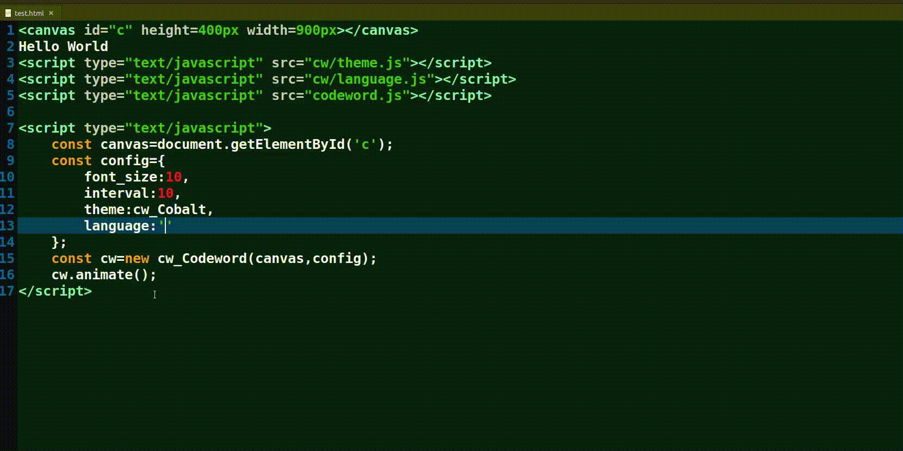

# codeword.js

### *Bring code-based styles and themes to your webpages.*

## GIF:



## Included files:

- #### cw: Directory containing all language definitions and themes used by the library.
    - #### cw/language.js:  Contains all the language definitions.
    - #### cw/theme.js:  Contains all the theme definitions.
- #### codeword.js: Contains the core library functions and animations. This must be included after both of the above script files have been included.

## What this library needs:

- #### The library is written in Vanilla JS. There are no dependencies on other JS libraries.
- #### The library relys on the html canvas element for its animation.

## Core Classes:

- ### The core class is cw_Coreword.
- ### It takes two parameters:.
    - ### An html canvas object.
    - ### A configuration object.

## Configuration:

- #### The following configurations are currently supported:
    - #### Font size.
        - ##### An integer denoting the size of the font.
    - #### Font style.
        - ##### The font style as a string.
    - #### Language.
        - ##### The language to use.(mandatory)
    - #### Coding theme.
        - ##### The theme to use.(mandatory)
    - #### Animation interval.
        - ##### The animation interval.
- #### All of these are set in a configuration object and then passed as the second parameter of the cw_Codewrod class.

## Usage:

```html
<!--Create a canvas element.-->
<canvas id="c" height=400px width=900px></canvas>
<!--Import all the script files.-->
<script type="text/javascript" src="cw/theme.js"></script>
<script type="text/javascript" src="cw/language.js"></script>
<script type="text/javascript" src="codeword.js"></script>
<!--Configure the codeword animation.-->
<script type="text/javascript">
	const canvas=document.getElementById('c');
	const config={
		font_size:10,
		interval:50,
		theme:cw_Cobalt,
		language:'C'
	};
	const cw=new cw_Codeword(canvas,config);
	//Begin the animation.
	cw.animate();
</script>
```


## Acknowledgements:

- #### The 'Cobalt' style has been taken from the Gedit Cobalt theme by Will Farrington.
- #### The definitions for the languages are according to those specified in the gtksourceview .lang files in Linux.


