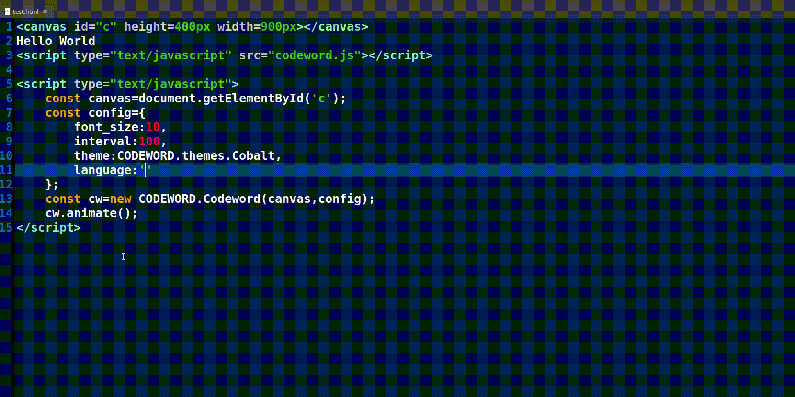

# codeword.js

### *Bring code-based styles and themes to your webpages.*

## GIF:



## What this library is:

- ### This library animates your canvas to mimic the syntax highlighting followed by code editors.
- ### Keywords native to a particular language are filled in across the canvas as though being typed.
- ### The keywords are highlighted according to the theme specified.

## Include files:

- ### codeword.js is a single source file. Include the file 'codeword.js' in your webpage and use it.

## What this library needs:

- ### Nothing but a canvas.
- ### The library is written in Vanilla JS. There are no dependencies on other JS libraries.
- ### It relys on the html canvas element for its animation.

## Library Structure:

- ### codeword.js contains a single JS object called CODEWORD which serves as the namespace for the library.
- ### The namespace contains the following 'sub-namespaces':
    - ### utilities:All utility functions.
    - ### languageSpec:The specifications for the languages supported.
    - ### themes:The supported themes.
    - ### Codeword:The main class containing the animations.
    - ### init:All setup functions. These are run automatically when the library loads.

## Configuration:

- ### The following configurations are currently supported:
    - #### Font size.
        - ##### An integer denoting the size of the font.
    - #### Font style.
        - ##### The font style as a string.
    - #### Language.
        - ##### The language to use.(mandatory)
    - #### Coding theme.
        - ##### The theme to use.(mandatory)
    - #### Animation interval.
        - ##### The animation interval.
- ### All of these are set in a configuration object and then passed as the second parameter of the cw_Codewrod class.

## Usage:

```html
<!--Create a canvas element.-->
<canvas id="c" height=400px width=900px></canvas>
<!--Import the library.-->
<script type="text/javascript" src="codeword.js"></script>
<script type="text/javascript">
	const canvas=document.getElementById('c');
	const config={
		font_size:10,
		interval:100,
		theme:CODEWORD.themes.Cobalt,
		language:'C'
	};
	const cw=new CODEWORD.Codeword(canvas,config);
	cw.animate();
</script>
```

## Acknowledgements:

- ### The 'Cobalt' style has been taken from the Gedit Cobalt theme by Will Farrington.
- ### The definitions for the languages are according to those specified in the gtksourceview .lang files in Linux.


